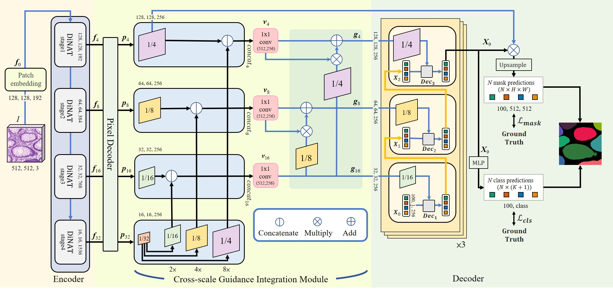

# Cross-scale Guidance Integration Transformer

## Cross-scale Guidance Integration Transformer for Instance Segmentation in Pathology Images.



## Instruction
Before proceeding, make sure to follow the installation instructions in the sections below.
Next, download the GlaS dataset in <https://warwick.ac.uk/fac/cross_fac/tia/data/glascontest/> and put it into `../datasets/`.

## Environment setup
For the mask-attention modules, please follow the instructions in <https://github.com/facebookresearch/Mask2Former/blob/main/INSTALL.md>

For the dilated dilated-neighborhood attention structure, please follow the instructions in <https://github.com/SHI-Labs/Neighborhood-Attention-Transformer>


## Data preparation
We follow the dataset preparation process in Mask2former, so please follow the instructions in <https://github.com/facebookresearch/Mask2Former/blob/main/datasets/README.md>

## Training
```
python train_m2f.py --config-file configs/coco/instance-segmentation/dinat/maskformer2_dinat_large_IN21k_384_bs16_100ep.yaml \ --num-gpus SOLVER.BASE_LR SOLVER.IMS_PER_BATCH SOLVER.MAX_ITER
```

## Visualization
```
python demo/demo.py --config-file configs/coco/instance-
segmentation/dinat/maskformer2_dinat_large_IN21k_384_bs16_100ep.yaml --input
datasets/glas/*.png --output demo/outputFileName --opts
MODEL.WEIGHTS output/model_final.pth
```

## Score counting
First, generate the predicted output using `demo/demo.py`.
Then, calculate the score in MATLAB using the ground truth.
The MATLAB evaluation code is located in the `/score` directory.


## Reference 
Please cite the following paper when you apply the code. 

Y.-M. Kuo, J.-C. Sheng, C.-H. Lo, Y.-J. Wu and C.-R. Huang, "Cross-Scale Guidance Integration Transformer for Instance Segmentation in Pathology Images," in IEEE Open Journal of Engineering in Medicine and Biology, vol. 6, pp. 413-419, 2025, doi: 10.1109/OJEMB.2025.3555818.

[https://ieeexplore.ieee.org/document/10273605](https://ieeexplore.ieee.org/document/10945390)
